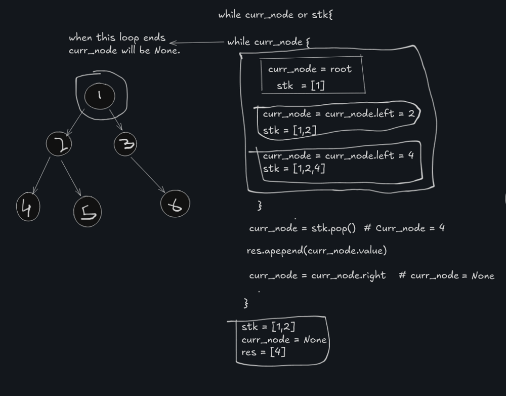
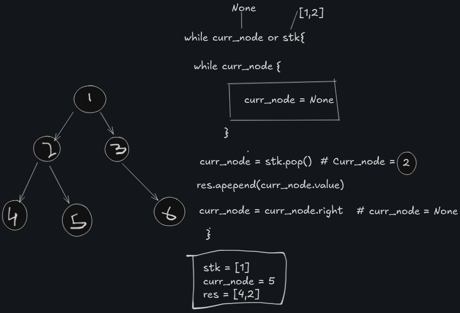
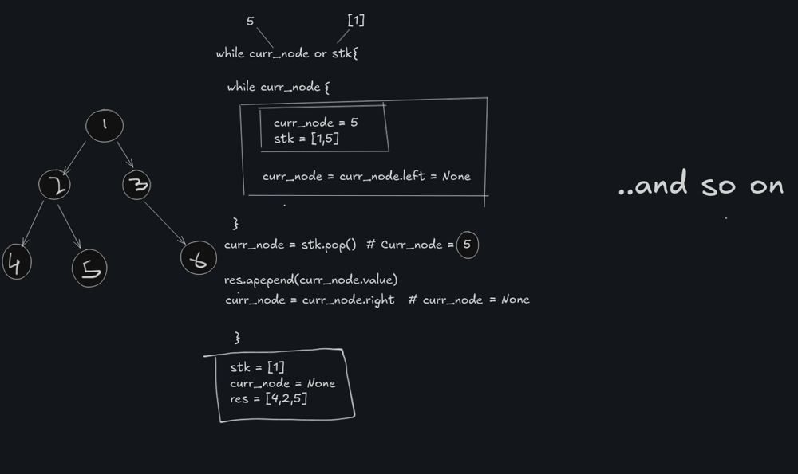

# Inorder Traversal

We know that the inorder traversal follow Left-> Root -> Right order.

- In inorder traversal, we always try to reach the leftmost node first.
- Once there, we visit the node, then move up to its parent, and finally explore the right subtree.
- This pattern ensures that all nodes are visited in Left → Root → Right order.

Inorder traversal follows the order: Left → Root → Right.

1. Start from the root node and try to reach the leftmost node:

    - Keep moving to the left child, pushing each node onto a stack.

    - This ensures we revisit the node after exploring its left subtree.

2. Once the leftmost node is reached (i.e., the current node has no left child):

    - Pop the node from the stack and visit it (add to result).

    - Then move to its right child.

3. Repeat this process:

    - Keep moving left while pushing nodes onto the stack.

    - Pop and process the node.

    - Then move right.

4. The traversal ends when:

    - There are no more nodes to visit, and

    - The stack is empty
  

